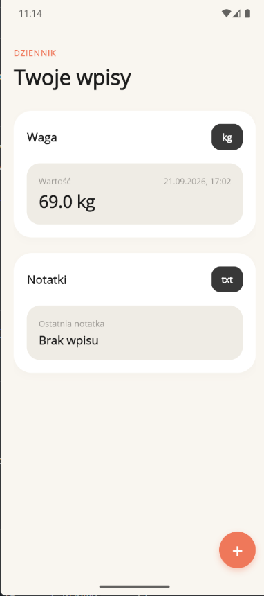
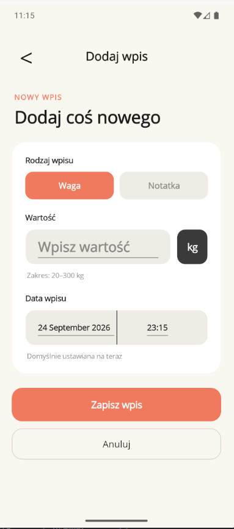

# Mini Dziennik

Mobilna aplikacja typu dziennik napisana w **.NET MAUI (C#)**. Projekt zrealizowany w parze podczas praktyk zawodowych, na podstawie wcześniej przygotowanego mockupu i moodboardu.

## Funkcje

<!-- UZUPEŁNIJ: wypisz to, co aplikacja faktycznie robi -->
- Dodawanie wpisów do dziennika
- Przeglądanie listy wpisów
- Edycja i usuwanie wpisów
- Aplikacja składa się z 5 ekranów

## Zrzuty ekranu

<!-- UZUPEŁNIJ: zrób screeny z emulatora i wrzuć je do docs/screenshots/ -->
| Ekran główny | Dodawanie wpisu | Szczegóły |
|---|---|---|
|  |  |  |

## Technologie

- .NET MAUI, C#
- XAML
- Wzorzec MVVM z użyciem `Command` (zamiast obsługi zdarzeń `Clicked`)
- Testowane na emulatorze Androida (Pixel 8, API 36)

## Uruchomienie

Wymagania:

- Visual Studio 2022 lub nowsze z workloadem **.NET Multi-platform App UI development**
- .NET SDK w wersji zgodnej z projektem (sprawdź `TargetFramework` w pliku `.csproj`)
- Emulator Androida albo urządzenie z włączonym debugowaniem USB

Kroki:

```bash
git clone https://github.com/maciejtokarz-dev/<nazwa-repozytorium>.git
```

1. Otwórz plik `ProjektPraktyka_MiniDziennik.slnx` w Visual Studio.
2. Wybierz cel uruchomienia: **Android Emulator**.
3. Uruchom projekt (F5).

## Struktura projektu

<!-- UZUPEŁNIJ: dopasuj do prawdziwych folderów -->
```
ProjektPraktyka_MiniDziennik/
├── Models/        # modele danych
├── ViewModels/    # logika widoków (MVVM)
├── Views/         # ekrany XAML
└── Resources/     # obrazy, czcionki, style
```

## Autorzy

Projekt realizowany w parze podczas praktyk:

- **Maciej Tokarz** – [UZUPEŁNIJ: za co byłeś odpowiedzialny, np. ekrany, style, nawigacja]
- **[UZUPEŁNIJ: imię/login kolegi]** – [UZUPEŁNIJ: zakres pracy]

## Możliwe dalsze usprawnienia

- Przechowywanie wpisów w lokalnej bazie danych (SQLite)
- Wyszukiwanie i filtrowanie wpisów
- Testy jednostkowe warstwy ViewModel
- Ciemny motyw
