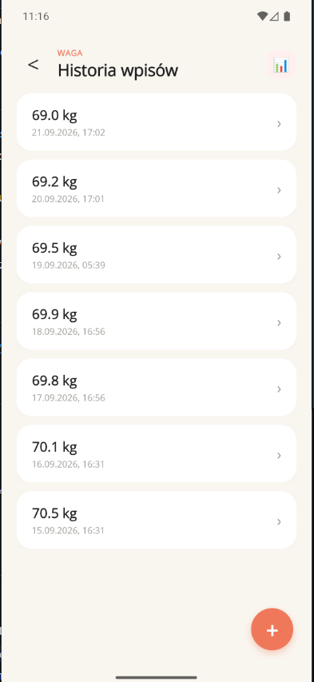
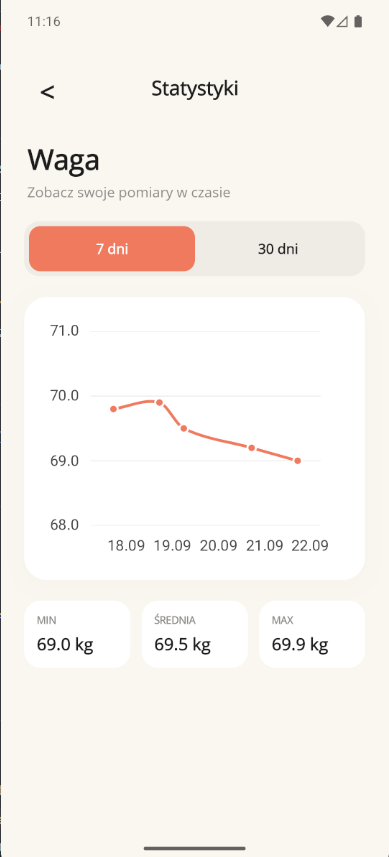

# Mini Dziennik

Mobilna aplikacja typu dziennik napisana w **.NET MAUI (C#)**. Pozwala zapisywać pomiary wagi oraz notatki, przeglądać historię wpisów i śledzić zmiany wagi na wykresie. Dane są przechowywane lokalnie w **SQLite**.

Projekt zespołowy (2 osoby): od moodboardu i mockupu, przez design, po działającą aplikację na Androida.

## Funkcje

- **Ekran główny**: podsumowanie z ostatnim pomiarem wagi i ostatnią notatką
- **Dodawanie wpisu**: wybór rodzaju (waga lub notatka), walidacja zakresu wagi (20–300 kg), data i godzina domyślnie ustawiane na aktualne
- **Historia wpisów wagi**: lista pomiarów z przejściem do widoku szczegółów
- **Szczegóły wpisu**: podgląd, edycja i usuwanie
- **Statystyki wagi**: wykres zmian z ostatnich 7 lub 30 dni oraz wartości minimalna, średnia i maksymalna
- **Lokalna baza danych SQLite**: wpisy zostają w aplikacji po jej zamknięciu

## Zrzuty ekranu

<p>
  
  
  
  
</p>

## Technologie

- .NET MAUI, C#, XAML
- SQLite (lokalna baza danych)
- Wzorzec MVVM z użyciem `Command` (zamiast obsługi zdarzeń `Clicked`)
- Testowane na emulatorze Androida (Pixel 8, API 36)

## Uruchomienie

Wymagania:

- Visual Studio 2022 lub nowsze z workloadem **.NET Multi-platform App UI development**
- .NET SDK w wersji zgodnej z projektem (sprawdź `TargetFramework` w pliku `.csproj`)
- Emulator Androida albo urządzenie z włączonym debugowaniem USB

Kroki:

```bash
git clone https://github.com/maciejtokarz-dev/mini-dziennik-maui.git
```

1. Otwórz plik `ProjektPraktyka_MiniDziennik.slnx` w Visual Studio.
2. Wybierz cel uruchomienia: **Android Emulator**.
3. Uruchom projekt (F5).

## Struktura projektu

```
ProjektPraktyka_MiniDziennik/
├── Models/        # modele danych
├── ViewModels/    # logika widoków (MVVM)
├── Views/         # ekrany XAML
└── Resources/     # obrazy, czcionki, style
```

## Autorzy

Projekt wykonany w dwuosobowym zespole (design i implementacja):

- **Maciej Tokarz**: strona główna, lista wpisów, baza danych, wykres
- **Paweł Nowakowski**: szczegóły wpisu, statystyki wagi, edycja, usuwanie

## Możliwe dalsze usprawnienia

- Eksport danych do pliku (CSV)
- Przypomnienia o dodaniu wpisu
- Kolejne rodzaje pomiarów (np. sen, nawodnienie)
- Wyszukiwanie i filtrowanie wpisów
- Testy jednostkowe warstwy ViewModel
- Ciemny motyw
